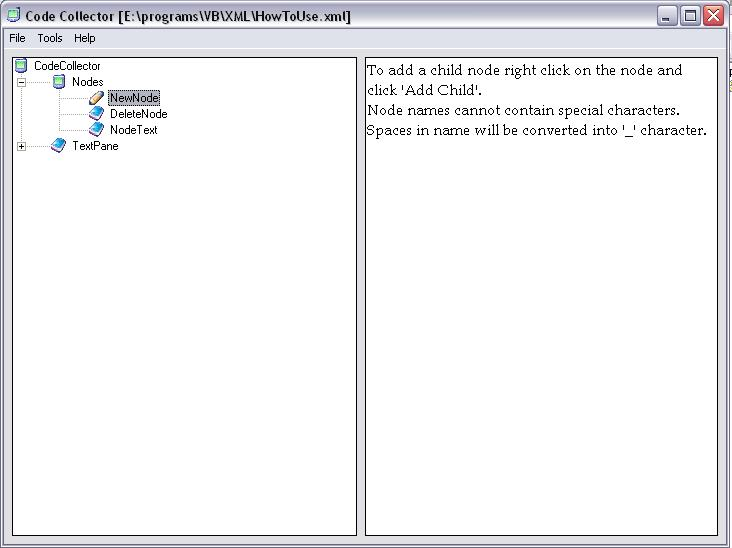



## XML Parser v1\.2

### Description

This is a simple xml parser using MSXML 4.0.

It is used to store code/data associated with a category or keyword such that the categories can be infinitely nested.

Version upgrades:

Minor Bug fixes.

Multidocument Interface.

Renaming nodes allowed.

Drag and Drop of nodes implemented.

And other small enhancements.

You will need to download MSXML 4.0 from the microsoft site.

Other than that it uses treeview control, commondialog control and Rich text box(SP6).

Plz send your comments/criticism etc.
 
### More Info
 

             |
---                |---
**Submitted On**   |2005-12-06 15:58:36
**By**             |[Bhupendra Aole](https://github.com/Planet-Source-Code/PSCIndex/blob/master/ByAuthor/bhupendra-aole.md)
**Level**          |Intermediate
**User Rating**    |4.5 (18 globes from 4 users)
**Compatibility**  |VB 6\.0
**Category**       |[Miscellaneous](https://github.com/Planet-Source-Code/PSCIndex/blob/master/ByCategory/miscellaneous__1-1.md)
**World**          |[Visual Basic](https://github.com/Planet-Source-Code/PSCIndex/blob/master/ByWorld/visual-basic.md)
**Archive File**   |[XML\_Parser19555112102005\.zip](https://github.com/Planet-Source-Code/bhupendra-aole-xml-parser-v1-2__1-63444/archive/master.zip)

